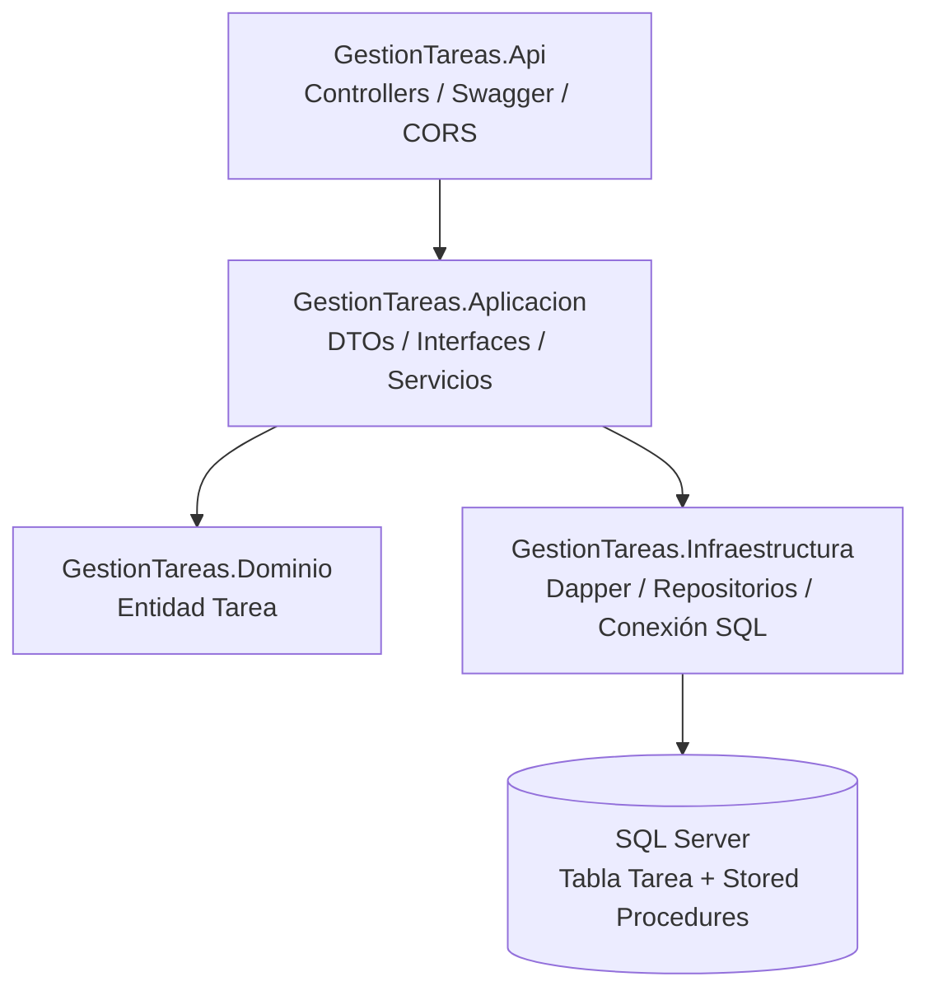
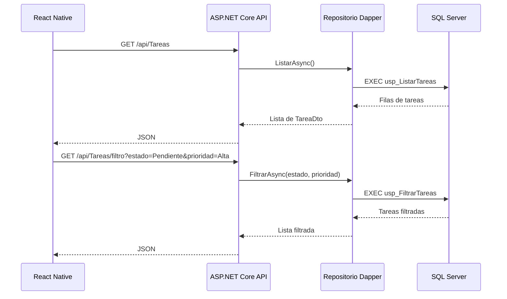

# Diagramas del proyecto Gestión de Tareas

## 1. Arquitectura del backend

```mermaid
flowchart TD
    A[GestionTareas.Api<br/>Controllers / Swagger / CORS]
    B[GestionTareas.Aplicacion<br/>DTOs / Interfaces / Servicios]
    C[GestionTareas.Dominio<br/>Entidad Tarea]
    D[GestionTareas.Infraestructura<br/>Dapper / Repositorios / Conexión SQL]
    E[(SQL Server<br/>Tabla Tarea + Stored Procedures)]

    A --> B
    B --> C
    B --> D
    D --> E
```

## 2. Comunicación App - API - Base de datos

```mermaid
sequenceDiagram
    participant App as React Native
    participant API as ASP.NET Core API
    participant Repo as Repositorio Dapper
    participant DB as SQL Server

    App->>API: GET /api/Tareas
    API->>Repo: ListarAsync()
    Repo->>DB: EXEC usp_ListarTareas
    DB-->>Repo: Filas de tareas
    Repo-->>API: Lista de TareaDto
    API-->>App: JSON

    App->>API: GET /api/Tareas/filtro?estado=Pendiente&prioridad=Alta
    API->>Repo: FiltrarAsync(estado, prioridad)
    Repo->>DB: EXEC usp_FiltrarTareas
    DB-->>Repo: Tareas filtradas
    Repo-->>API: Lista filtrada
    API-->>App: JSON
```
